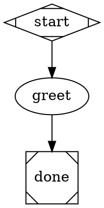
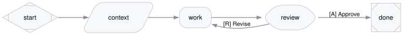
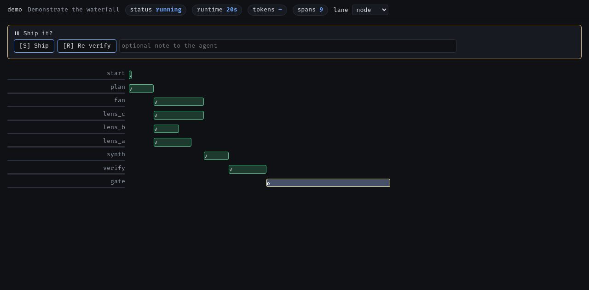
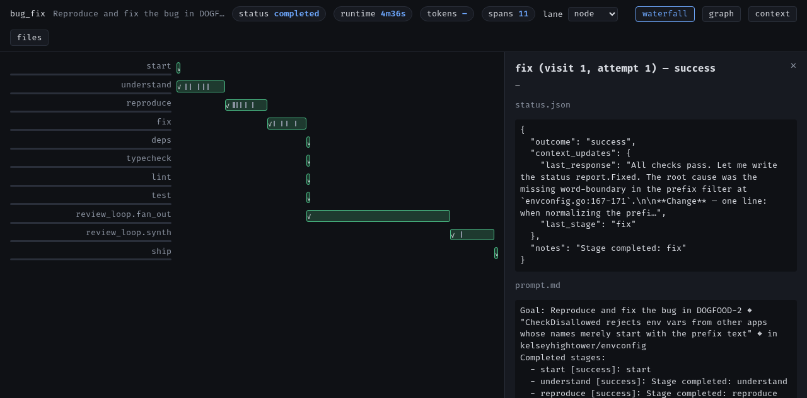
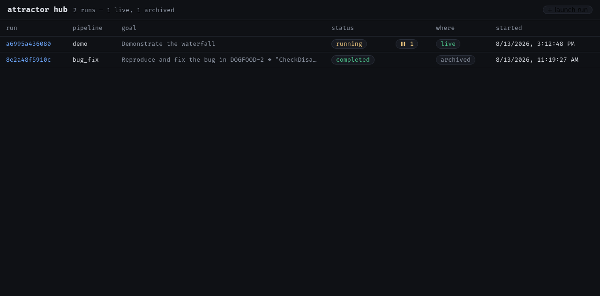

# attractor

A Go implementation of [Attractor](https://github.com/strongdm/attractor).
You write a multi-stage AI workflow as a Graphviz DOT file. Each node is
one stage: an LLM agent, a shell command, a human approval gate, or a
parallel fan-out. Each edge is a route, with an optional condition.
attractor runs the pipeline, retries transient failures, records every
step, and shows a live view of the run.



A pipeline is plain text. You version it, diff it, and render it. This is
the quickstart pipeline from [Get started](#run-your-first-pipeline),
rendered with `attractor render`. It runs a shell command, then an agent,
then a human gate:



## Get started

### Install

**Nix (recommended).** One command installs a binary that already carries
what a run needs on its `PATH`: `graphviz` and the ACP agent adapters
(`claude-agent-acp`, `codex-acp`). You need [nix](https://nixos.org) with
flakes. To install Nix itself, the
[Determinate Nix installer](https://github.com/DeterminateSystems/nix-installer)
is the simplest option, and it turns on flakes for you.

```bash
nix profile install github:allouis/attractor
# Or run it without installing:
nix run github:allouis/attractor -- run --help
```

**Prebuilt binary.** Download the build for your operating system and
architecture from the [releases page](https://github.com/allouis/attractor/releases).
Put `attractor` on your `PATH`. The bare binary carries no tools, so
install `graphviz` yourself (`brew install graphviz`), and an ACP agent
adapter (see [Set up an agent](#set-up-an-agent)).

On macOS, a binary downloaded through a browser is quarantined by
Gatekeeper. Since the release isn't notarized, running it as-is gets
silently killed from a terminal, or blocked with "Apple could not verify
this app is free of malware" from Finder. Clear the quarantine flag once,
after verifying the download against `checksums.txt`:

```bash
xattr -d com.apple.quarantine ./attractor
```

**From source.** Clone the repository and build it with Nix. This also
gives you the `pipelines/` and `examples/` directories to edit.

```bash
git clone https://github.com/allouis/attractor && cd attractor
nix build .#attractor     # Result: ./result/bin/attractor
```

### Set up an agent

A `codergen` node runs an agent through the
[Agent Client Protocol](https://agentclientprotocol.com) (ACP). The
default agent is `claude-agent-acp`. The Nix install bundles it. For a
prebuilt binary, install an adapter yourself and put its command on your
`PATH`:

- [`claude-agent-acp`](https://github.com/agentclientprotocol/claude-agent-acp) — Claude.
- [`codex-acp`](https://github.com/agentclientprotocol/codex-acp) — Codex.

`claude-agent-acp` needs Node.js 22+ and installs from npm:

```bash
npm install -g @agentclientprotocol/claude-agent-acp
```

Then authenticate once, the same way as Claude Code:

```bash
claude                       # Sign in through Claude Code (credentials go to ~/.claude/)
# Or:
export ANTHROPIC_API_KEY=sk-ant-…
```

### Run your first pipeline

Here is the smallest useful pipeline: one shell step, one agent step, and
one human gate. Save it as `quickstart.dot`.

```dot
digraph quickstart {
    rankdir = "LR"   // Render left-to-right.
    vars = "task"    // Required. Pass it with -var task="…".

    start   [shape=Mdiamond]
    context [type="tool", tool_command="git status --short"]   // A shell command.
    work    [type="codergen", prompt="You are working in the current Git repository. Task: $context.task. Make the change, keep it small, and summarise it. Do not commit or push."]   // An agent.
    review  [type="wait.human", label="Apply this change?"]    // A human gate.
    done    [shape=Msquare]

    start -> context -> work -> review
    review -> done [label="[A] Approve"]   // The edge labels become the gate buttons.
    review -> work [label="[R] Revise"]
}
```



Run it inside a Git repository that you want to change:

```bash
cd ~/your-repo
attractor run /path/to/quickstart.dot \
  -var task="add a hello() function to the README" \
  --backend acp --acp-cmd claude-agent-acp --cwd "$(pwd)" --ui
```

attractor prints a URL. Open it to watch the run. The agent edits the
working tree in place, then stops at the gate. Nothing is committed or
pushed, so you review the change yourself and then approve or revise it.

- `-var name=value` seeds the run's context. A pipeline's `vars="…"` list
  declares which variables are required. A missing one fails the run
  before any node executes.
- `--backend acp --acp-cmd claude-agent-acp` sends every agent node to the
  ACP adapter. To route each node to a different model instead, drop
  `--backend` and pass `--stylesheet` (see [Customise it](#customise-it)).
- `--cwd "$(pwd)"` points tool and codergen nodes at the repo you want
  changed. Without it, they run against attractor's own run directory, not
  your shell's working directory.
- `--ui` serves the run's live view. In a terminal, the view stays up
  after the run finishes, until you press Ctrl-C.

Validate a pipeline before you run it, and dry-run the wiring with no LLM:

```bash
attractor validate quickstart.dot                       # Lint: catches typos and missing files
attractor run --backend simulation -var task=x quickstart.dot   # Wiring test, no agent
```

### Next: choose the model with a stylesheet

The run above sent every agent node to one adapter. To choose the model
instead, write a stylesheet and drop `--backend`. Save this as `models.css`:

```css
/* Set the model for every agent node. */
* { llm_model: claude-opus-4-8 }
```

Then run with the stylesheet:

```bash
attractor run /path/to/quickstart.dot -var task="…" \
  --stylesheet models.css --cwd "$(pwd)" --ui
```

Each node now routes through a provider. The model prefix picks the
provider (`claude…` → anthropic), so no config file is needed. A larger
pipeline gives its nodes role classes — `.plan`, `.build`, `.review` — and
the stylesheet maps each class to a model, so one run can mix models. See
[Customise it](#customise-it).

### Where pipelines live

`attractor run <name>` resolves a bare name against these locations, in
order:

1. `./pipelines/<name>/pipeline.dot` — the working directory.
2. `~/.attractor/pipelines/<name>/pipeline.dot` — your personal library.
3. `$ATTRACTOR_PIPELINES/<name>/pipeline.dot` — the bundle shipped with
   the binary (the Nix build sets this).

To install your own pipeline, copy its directory into
`~/.attractor/pipelines/`. You can also run a pipeline by its path
(`attractor run path/to/pipeline.dot`).

The shipped pipelines live under `pipelines/`:

| Pipeline | Purpose |
|---|---|
| `plan-build-review` | Plan a change, gate the plan, implement it, run checks, review it, gate the ship, open a draft PR. |
| `amend-pr` | The same plan-build-review cycle on an existing PR, pushed back in place. |
| `review-pr` | Review a PR from its diff, no checkout. |
| `revise-pr` | Check, review, and fix a PR branch, then push. |
| `checks` | Run the repository's deps/typecheck/lint/test chain. |
| `review-core`, `checks-core` | Shared sub-pipelines that the others embed with `subgraph`. |

The shipped pipelines use [`jj` (Jujutsu)](https://jj-vcs.github.io/jj/) for
their version-control steps — reading the diff, committing, and pushing.
The Nix build bundles `jj`; for a prebuilt binary, install it with
`brew install jujutsu`. Your own pipelines can use any tool you like.

## How it works

**A run is self-contained.** `attractor run` starts the engine, serves the
run's own read-only API and UI (`--ui`), and writes everything to one
directory. It needs no server. You launch a run, watch it, answer its
gates, and debug it — all from that one process. A run works the same on a
laptop, a remote box, CI, or a VM.

The hub is optional. It aggregates many runs into one place, and a single
run needs nothing from it. See [Watch many runs](#watch-many-runs-the-hub)
below.

**Everything a run is lives in one directory** (`~/.attractor/runs/<id>`):

```
run.json           Identity: run id, pipeline name, resolved goal.
events.jsonl       The source of truth: every engine event, one JSON object per line.
checkpoint.json    The resume point, rewritten after each completed node.
<node>@v1.a1/      One directory per execution attempt. It holds prompt.md,
<node>@v2.a1/        response.md, status.json (the engine's verdict),
                     agent-status.json (the agent's self-report), and tool_calls/.
```

A directory name is the identity of a span: the node, the visit (which
trip through the pipeline), and the attempt (a retry within a visit). To
debug a run, read `events.jsonl` and the span directories. That is all
there is. Every view — the waterfall UI, the hub, the API — is derived
from the event log, never stored twice.

**The engine walks the pipeline one node at a time.** It resolves the
node's handler, runs it with retries, applies the outcome to the shared
context, then follows the first edge whose condition matches. For
example, `condition="outcome=fail"` routes a failure to a fix stage.

The node types are:

- `codergen` — an LLM agent. It edits files and self-reports its outcome
  through a status file.
- `tool` — a shell command.
- `wait.human` — an approval gate. The edge labels become the buttons.
- `parallel` — a fan-out. The branches run at the same time and converge.
- `subgraph` — another pipeline, embedded at load time.

Deterministic guards keep a run from dying or spinning:

- A transient failure (a rate limit, a 5xx, a stall, a network error)
  retries with backoff. An auth or config error fails at once.
- An agent that forgets its status file gets a corrective follow-up in
  the same session, not a cold retry.
- A run that keeps failing the same way stops early. A harness error is
  never sent to a fix agent as if it were a code finding.

### Watch a run

`--ui` serves a live waterfall: one lane per node, with live spans,
tool-call marks, token counts, and click-through to each stage. An
approval gate shows the work leading into it, so you see what you
approve. Parallel branches run side by side.



Click a span to open its full story: the agent's prompt and response, the
engine's `status.json`, the agent's own self-report, a tab for each
execution when a node ran more than once, and every tool call. Header
tabs switch to the rendered pipeline, the run's context, and a browser
over the whole run directory.



The same data is served as JSON (`/pipelines/{id}`, `/events?since=N`,
`/artifacts/…`, `/graph`) for scripts and agents.

### Watch many runs: the hub

The hub is a directory and archive for many runs. A run registers itself
once at start with `--announce`. The hub then polls the run's own API for
live state, proxies gate answers, and stores the run's archive when it
finishes. Because the hub only pulls, a hub outage never loses run data.

```bash
attractor hub --bind 127.0.0.1:7690 --dir ~/.attractor/hub

attractor run --announce http://127.0.0.1:7690 … plan-build-review   # Self-registers.
```

The hub has its own UI at `/ui`: a list of live and archived runs, and
the same waterfall page for each. Gates are answerable from the hub too.



On a server, run the hub as the one long-lived service. The flake ships
NixOS and home-manager modules:

```nix
# Add the flake input `attractor`, then:
services.attractor-hub.enable = true;   # Binds 127.0.0.1:7690.
```

Keep the hub on loopback and tunnel in (`ssh -L 7690:127.0.0.1:7690 box`,
or Tailscale). One forwarded port covers watching every run, answering
every gate, and browsing every archive. For runs on other machines, start
each one with `--ui-token <secret>`. The token travels in the announce,
and the hub uses it on every poll.

## Customise it

**Choose a model per node with a stylesheet.** A pipeline carries role
*classes* (`plan`, `build`, `review`), not model names. A stylesheet maps
those to models. Drop `--backend` so each node routes through a provider,
and pass a stylesheet:

```bash
attractor run --ui --stylesheet pipelines/models.css … plan-build-review
```

A stylesheet targets nodes with four kinds of selector, from least to most
specific:

```css
*          { llm_model: claude-fable-5 }    /* Every agent node. */
box        { llm_model: claude-fable-5 }    /* By graphviz shape. */
.review    { llm_model: claude-opus-4-8 }   /* By node class. */
#implement { llm_model: claude-opus-4-8 }   /* One node, by its id. */

/* Mix providers freely — send one node to Codex, the rest stay on Claude. */
#review_loop.correctness {
    llm_provider: codex
    llm_model: gpt-5.6-sol
    reasoning_effort: high
}
```

A more specific selector wins. At equal specificity, the later rule wins.
An explicit `llm_model` on the node itself always wins, so a mandatory pin
survives the sheet. The properties are `llm_model`, `llm_provider`, and
`reasoning_effort`. The provider is inferred from the model prefix
(`claude…` → anthropic, `gpt…` → openai), so `llm_model` alone is usually
enough; set `llm_provider` explicitly to route a node to Codex.

The bundled `anthropic` and `codex` providers work with no config file.
Write `~/.attractor/config.json` only for custom providers or models:

```json
{
  "default_provider": "anthropic",
  "providers": {
    "anthropic": {"backend": "acp", "command": "claude-agent-acp", "model_env": "ANTHROPIC_MODEL"},
    "codex":     {"backend": "acp", "command": "codex-acp",        "model_env": "CODEX_MODEL"}
  }
}
```

A node picks a provider or model with `llm_provider=` and `llm_model=`
attributes. A node with neither uses the default provider. For the full
resolution rules, see the [models
section](./docs/running-pipelines.md#models) of the runbook.

**Use a different agent.** Any agent that speaks the Agent Client Protocol
works with no Go code. Point a node (`acp_command="my-agent"`), a
pipeline, `--acp-cmd`, or a provider entry at its command.

**Write your own pipeline.** A pipeline is a directory with a
`pipeline.dot` file. It references prompt files as
`prompt="@prompts/task.md"`. Start from `pipelines/plan-build-review/`,
and keep `attractor validate` green. The `context_refs` lint checks every
`$context.*` reference against the declared vars and node outputs, so a
typo fails before a run does.

For the full flag list, the per-pipeline `-var` contracts, the `--json`
event schema, and dispatch notes, see the runbook:
[docs/running-pipelines.md](./docs/running-pipelines.md).

## Relationship to the Attractor spec

The [upstream spec](./docs/spec/attractor.md) is kept pristine in this
repository, and the implementation follows it closely: the same node
types, outcome model, context, checkpointing, and status-file contract.
Each deliberate difference is written down in
[docs/spec/amendments/](./docs/spec/amendments/README.md). Three matter
day to day:

- **`$context.<key>` is interpolated at runtime**, against the live
  context, not at parse time. An undefined key fails the node, so a typo
  surfaces instead of passing through.
- **Every execution attempt keeps its own directory** — one
  `<node>@v<visit>.a<attempt>/` directory per attempt — so a review or
  fix loop never overwrites the evidence of an earlier round.
- **The spec's runtime manager-loop node is not implemented.** Instead,
  `type="subgraph"` composes sub-pipelines with a load-time transform,
  which is the spec's own §9 extension mechanism.

## Develop

The layout: `internal/engine` (pipeline traversal, retries, guards, the
event log), `internal/handler` (node types), `internal/backend` (agent
transports), `internal/transform` (subgraph and prompt inlining),
`internal/lint` (validation), `internal/runserver` and `internal/runview`
(the per-run API, UI, and event-log folds), and `internal/hub`. The e2e
suite in `tests/` drives real pipelines through the real engine. TDD is
the norm: a bug gets a failing test first.

```bash
nix develop --command go test ./...    # The full suite, offline, about 20s.
```

**Write a new codergen backend** for an agent that does not speak ACP.
Implement one interface in a subpackage of `internal/backend`:

```go
type CodergenBackend interface {
    Run(env engine.HandlerEnv, prompt string) (Result, error)
}
```

Return the agent's text, or an explicit `Outcome`. Wrap a transient error
with `backend.Transient(err)` so the retry machinery engages. Wire the
backend into `internal/backend/router` and the `--backend` flag in
`internal/cli`. `internal/backend/acp` is the worked example, and
`internal/backend/fake` shows the test-harness pattern.

**Agents inside a pipeline** must self-report through
`{stage_dir}/status.json` (the literal path is substituted into the
prompt): `{"outcome":"success"}` or
`{"outcome":"fail","failure_reason":"…"}`, plus an optional
`"context_updates":{…}` to publish values downstream. After a failure,
`$context.failure_reason` carries what went wrong.

| Doc | Covers |
|---|---|
| [attractor spec](./docs/spec/attractor.md) | The upstream pipeline and engine spec (pristine). |
| [amendments](./docs/spec/amendments/README.md) | Every deliberate deviation from the spec. |
| [running pipelines](./docs/running-pipelines.md) | The dispatch runbook: run command, vars, models, events, notes. |

## License and attribution

[Apache License 2.0](./LICENSE). attractor is a Go implementation of
[strongdm/attractor](https://github.com/strongdm/attractor), which is
also Apache-2.0.
