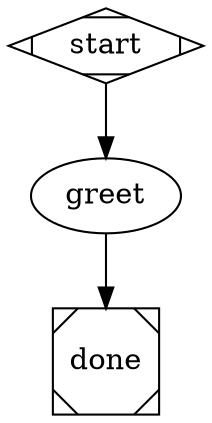

# attractor

A Go implementation of [Attractor](https://github.com/strongdm/attractor) —
a DOT-based pipeline runner for multi-stage AI workflows. Each node is a
stage (LLM call, human gate, tool call, parallel fan-out, inlined
sub-pipeline); edges route between them with conditions, labels, and
weights. Pipelines are a constrained Graphviz DOT subset — plain text,
version controlled, rendered to SVG with standard tooling.

This README covers both **how to use it** and **how to understand it** —
the second half is a mental model of what actually happens during a run,
written for humans and agents working on or with this tool.

## Install

```bash
nix build .#attractor     # → ./result/bin/attractor (+ hookshim)
```

Needs [nix](https://nixos.org) with flakes. The runtime closure bundles
`graphviz`, `jj`, and the ACP agent adapters (`claude-agent-acp`,
`codex-acp`), so rendering and agent runs work wherever the binary lands.

## Quickstart

A pipeline is a directory with a `pipeline.dot` graph. Prompts reference
run context with `$context.<key>`:



```bash
attractor run --backend simulation -var name=world hello/pipeline.dot
attractor run --backend acp --ui -var name=world hello/pipeline.dot
```

`-var name=world` seeds the run context; `vars="name"` declares it
required, so a missing value fails before any node runs. `--backend
simulation` returns synthetic responses (no LLM). `--ui` serves the
run's own live API + waterfall view (URL printed at start).

## The unit: a self-contained run

The core design decision (see
[local-first-plan](./docs/local-first-plan.md)): **a run owns all of its
state and can serve it itself.** No daemon or hub is required for
anything — launching, watching, answering gates, debugging.

```
attractor run --ui            # the unit: engine + read-only self-serving API/UI
        │                     # runs anywhere: laptop, remote box, inside a VM
        │ announce once ────▶ hub (optional): directory + scraper + launcher + archive
        │                     # hub PULLS /pipelines/{id} + /events?since= from live runs
        └ on complete: tar run dir → ship to hub for the permanent record
```

- **Pull, not push.** The hub scrapes; runs never stream events to it. A
  hub outage cannot lose run data, and a failed scrape doubles as the
  liveness signal.
- **Everything derives from the event log.** The run dir's
  `events.jsonl` is the single source of truth; every API document is a
  pure fold over it (see "How a run works" below).
- **Archive is the permanent record.** On completion the run tars its
  dir and ships it; the hub serves archived runs through the same API as
  live ones.

## How a run works (the mental model)

Understanding a run means understanding **one directory and one loop**.

### The run directory

Everything a run is lives under its logs dir (default
`~/.attractor/runs/<run-id>` or `$XDG_DATA_HOME/attractor/runs/<run-id>`):

```
<logs>/
  run.json           # identity: run id, graph name, resolved goal, start time
  events.jsonl       # THE source of truth: every engine event, one JSON per line
  checkpoint.json    # resume point, rewritten after each completed node
  <node_id>/
    v1/              # first visit: prompt.md, response.md, status.json, tool_calls/
    v2/              # second visit (the node was re-entered via a retry edge)
    prompt.md        # mirror of the LATEST visit (stable paths for tools/URLs)
    response.md
    status.json
```

Per-visit dirs are append-only history: a review/fix loop never destroys
the evidence of earlier rounds
([amendment A1](./docs/spec/amendments/visit-dirs.md)). To debug a run,
read `events.jsonl` and the visit dirs — that is all there is.

### The engine loop

The engine walks the graph one node at a time (parallel fan-outs run
inside a single `parallel` node):

1. **Resolve** the node's handler by `type=` (`codergen` LLM stage,
   `tool` shell command, `wait.human` gate, `parallel`, or the built-in
   start/exit/conditional).
2. **Execute** with retries. The handler returns an Outcome
   (`success | partial_success | retry | fail | skipped` + optional
   `context_updates`, `failure_reason`). `retry` re-runs with backoff up
   to the node's `max_retries` (graph `default_max_retries` fallback).
3. **Record**: apply `context_updates` to the shared key-value context,
   mirror `outcome` / `failure_reason` into context, write
   `status.json`, checkpoint, mirror the visit dir.
4. **Route**: pick the first outgoing edge whose `condition` matches
   (e.g. `condition="outcome=fail"`), else the unconditional edge.
   Reaching an exit node ends the run (after goal-gate checks).

Every step emits events (`stage_started`, `stage_retrying`,
`stage_completed`, …) stamped with a per-run sequence number, the node's
**visit** count, and the retry **attempt** — so `(node_id, visit,
attempt)` identifies an execution span, derivable from the log alone.

### What keeps runs from dying or looping forever

These guards exist because early dogfood runs burned hours on failures
no agent could fix:

- **Error classification (D1).** Backends classify at the boundary:
  transient failures (429/5xx, stalls, connection resets) become
  `retry`; auth/config/validation failures fail immediately. Shipped
  pipelines set `default_max_retries=2`.
- **Contract checks + in-session correction (D2).** After a codergen
  turn, deterministic checks verify the agent's claims (v1: the
  `status.json` self-report exists and parses, on `require_status`
  nodes). A violation sends a corrective follow-up **into the same agent
  session** (up to 2) — a cold retry would throw away everything the
  agent learned.
- **Machinery vs task failures (LG1).** A failure of the harness itself
  (a verdict that never arrived) is `failure_class=machinery`: it
  retries, then **terminates the run** — it never routes through
  `outcome=fail` edges to a fix agent, because a harness error is not a
  code finding.
- **Stuck-loop breaker (LG2).** The same node failing with the identical
  `failure_reason` 3 times in a row aborts the run (`stuck loop: …`);
  changing reasons are progress and never trip it. Tune with the
  `max_repeated_failures` graph attr (0 disables).
- **Visit caps.** `max_node_visits` (graph) / `max_visits` (node) bound
  revisits as the terminal backstop.

### Agent contracts (what an agent inside a pipeline must do)

An agent stage receives its prompt (with `$context.*` resolved) plus a
preamble carrying run state. Its obligations:

- **Self-report via `{stage_dir}/status.json`** — the literal path is
  substituted into the prompt; never guess it. Write
  `{"outcome": "success"}` or
  `{"outcome": "fail", "failure_reason": "..."}`, optionally with
  `"context_updates": {...}` to publish values for downstream nodes.
  Without a status file, a plain-text response is wrapped in `success` —
  except on `require_status` nodes, where a missing/invalid status is a
  machinery failure (see LG1).
- **Read what failed** from `$context.failure_reason` when routed back
  by a failed check or review — it carries the previous node's failure
  text (check output, review findings).
- `output_key="k"` on a node captures its full response into context key
  `k`; `outputs="a,b"` documents keys the agent sets via
  `context_updates` (the `context_refs` lint checks references against
  these).

## Composition

Two ways to embed one pipeline in another
([D6](./docs/local-first-plan.md)):

- **Child known at parse time → `subgraph`** (static inline):

  ```dot
  review [type="subgraph", graph_ref="../review-core/pipeline.dot",
          var.diff_cmd="jj diff"]
  work -> review
  review -> ship [condition="outcome=success"]
  review -> fix  [condition="outcome=fail"]
  ```

  The child's nodes are inlined at load time (IDs prefixed:
  `review.synth`), its start/exit spliced into your edges — the
  pre-exit node's outcome drives your conditions directly, and the UI
  shows the real fan-out. `var.*` satisfies the child's declared vars by
  static substitution.

- **Child chosen at runtime → `stack.manager_loop`** (the router
  dispatching an item to a work pipeline): runs the child engine inline,
  seeding its context from the parent; the child's terminal outcome
  becomes the node's outcome, telemetry lands under
  `$context.stack.child.*`.

## Observing a run

`attractor run --ui` mounts the run's own API (spec §9.5 shapes, one
run) plus a waterfall view at `/ui`:

| Endpoint | Serves |
|---|---|
| `GET /pipelines/{id}` | enriched doc: summary + spans + active nodes + pending questions + `last_seq` cursor |
| `GET /pipelines/{id}/events?since=N` | event replay (ndjson), monotonic cursor |
| `GET /pipelines/{id}/artifacts/…` | the run dir tree (stable `{node}/{file}` paths work mid-visit) |
| `GET /pipelines/{id}/questions`, `POST …/answer` | human gates, answered on the run itself |

The waterfall polls the doc on a 500 ms tick and renders spans in lanes
(group by node / thread / class / model via dropdown), with tool-call
tick marks, token chips, and click-through to each span's
prompt/response/status. Human gates render as answer buttons.

The **hub** (`attractor hub`) aggregates many runs: `POST /announce`
(runs self-register), `GET /runs` (live + archived, with reachability),
the same `/pipelines/…` read API proxied to live runs or served from
archives, and `POST /pipelines` to launch new runs as subprocesses. Auth
for remote runs: `run --ui-token <t>` + the token rides the announce.

## CLI

| Command | Purpose |
|---|---|
| `attractor run <name-or-path>` | parse, validate, execute (`--ui`, `--announce`, `-var`, `--backend`, `--human`, `--logs`, `--json`) |
| `attractor validate <path>` | transforms + lint only; catches missing prompt files and `$context` typos before any run |
| `attractor render <path> [-o out.svg]` | DOT → SVG via graphviz |
| `attractor hub` | pull-based run directory: announce + scrape + archive + launch |
| `attractor serve` | legacy HTTP daemon (submit, SSE, web UI, automations) |
| `attractor version` | print version |

Bare pipeline names resolve under `./pipelines/` then
`~/.attractor/pipelines/`. `prompt="@prompts/x.md"` inlines a file
relative to the `.dot` source.

## Backends

Without `--backend`, each codergen node picks a backend from the
provider config (`~/.attractor/config.toml`, overlaid by
`./.attractor/config.toml`) per its `llm_provider` / `llm_model`; with
no config the run falls back to simulation. `--backend` / `--acp-cmd`
are run-wide overrides. `simulation` skips the LLM; `acp` drives any
[Agent Client Protocol](https://agentclientprotocol.com) agent over
stdio (the bundled default is `claude-agent-acp`); `claude` wraps the
Claude Code CLI directly. See
[provider-config](./docs/provider-config.md) and
[acp-backend](./docs/acp-backend.md).

## Shipped pipelines

Under `pipelines/`: `bug-fix` (understand → reproduce → fix → checks →
multi-lens review → ship gate), `implement`, `review-pr`, `revise-pr`,
`build`, `checks`, `router` (dispatches intake items to the above), and
`review-core` — the shared five-lens adversarial review + synth verdict
that the others inline via `subgraph`.

## Docs

| Doc | Covers |
|---|---|
| [local-first-plan](./docs/local-first-plan.md) | the architecture: self-contained runs, pull-based hub, phased build-out |
| [attractor-spec](./docs/spec/attractor.md) | canonical pipeline / engine spec (kept pristine) |
| [spec amendments](./docs/spec/amendments/README.md) | every deliberate deviation: interpolation, routing, per-visit dirs, API surface |
| [loop-guards-spec](./docs/loop-guards-spec.md) | LG1/LG2: machinery failures, stuck-loop breaker |
| [codergen-backends-spec](./docs/codergen-backends-spec.md) | agent CLI integration |
| [acp-backend](./docs/acp-backend.md) | ACP backend, token usage, stall watchdog |
| [provider-config](./docs/provider-config.md) | per-node backend / model routing |
| [service-spec](./docs/service-spec.md) | legacy HTTP daemon + automations |
| [items-spec](./docs/items-spec.md) | work items (GitHub / Linear intake) |

## Contributing

Engine, handlers, and CLI live under `internal/`; the e2e suite (public
APIs only) is in `tests/`. TDD is the norm — bugs get a failing test
first. Run everything:

```bash
nix develop --command go test ./...
```

The real `claude` CLI is exercised by an opt-in test gated on
`ATTRACTOR_REAL_CLAUDE=1`; it skips otherwise, so the suite stays free
and offline-safe.

## License

[Apache License 2.0](./LICENSE) — matches upstream
[strongdm/attractor](https://github.com/strongdm/attractor).
