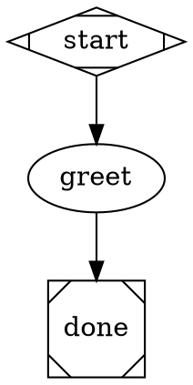

# attractor

A Go implementation of [Attractor](https://github.com/strongdm/attractor) —
a DOT-based pipeline runner for multi-stage AI workflows. Each node is a
stage (LLM call, human gate, tool call, parallel fan-out, supervisor
loop); edges route between them with conditions, labels, and weights.
Pipelines are a constrained Graphviz DOT subset — plain text, version
controlled, rendered to SVG with standard tooling.

## Install

```bash
nix build .#attractor     # → ./result/bin/attractor (+ hookshim)
```

Needs [nix](https://nixos.org) with flakes. The runtime closure bundles
`graphviz`, so SVG rendering works wherever the binary lands.

## Quickstart

A pipeline is a directory with a `pipeline.dot` graph. Prompts reference
run context with `$context.<key>`:



```bash
attractor run --backend simulation -var name=world hello/pipeline.dot
```

`-var name=world` seeds the run context; `vars="name"` declares it
required, so a missing value fails before any node runs. `--backend
simulation` returns synthetic responses (no LLM) — good for wiring tests.

## Key concepts

**Pipelines are directories.** Bare names resolve under `./pipelines/`
then `~/.attractor/pipelines/`; a path or `.dot` suffix loads directly.
`prompt="@prompts/greet.md"` inlines a file relative to the `.dot` source.

**Context interpolation (runtime).** Handlers expand `$context.<key>`
against the live context when the node runs — both seeded inputs and
values written by earlier nodes resolve. An undefined key **fails the
node** (`unresolved $context.foo`). `$goal` is the one built-in (sugar
for `$context.graph.goal`); `$$` is a literal `$`; every other `$`
(shell `$HOME`, `$(…)`, prose) passes through untouched. Full model:
[context-interpolation-spec](./docs/context-interpolation-spec.md).

**Backends.** Without `--backend`, each codergen node picks a backend
from the provider config (`~/.attractor/config.toml`, overlaid by
`./.attractor/config.toml`) per its `llm_provider` / `llm_model`; with no
config the run falls back to simulation. `--backend` / `--acp-cmd` are
run-wide overrides. `simulation` skips the LLM; `claude` runs Claude Code
via its stream-JSON CLI; `acp` drives any
[Agent Client Protocol](https://agentclientprotocol.com) agent over
stdio. See [provider-config](./docs/provider-config.md) and
[acp-backend](./docs/acp-backend.md).

## CLI

| Command | Purpose |
|---|---|
| `attractor run <name-or-path>` | parse, validate, execute |
| `attractor validate <path>` | lint only; non-zero exit on errors |
| `attractor render <path> [-o out.svg]` | DOT → SVG via graphviz |
| `attractor serve` | HTTP server (default `127.0.0.1:7681`) |
| `attractor automations list\|run <name>` | manage saved runs |
| `attractor version` | print version |

Key `run` flags: `--backend claude|acp|simulation`, `--acp-cmd CMD`,
`-var name=value` (repeatable), `--logs DIR`, `--json`,
`--human auto|console|approve`. Full list: `attractor run --help`.

## Server

`attractor serve` exposes the run API over HTTP (submit, stream events
via SSE, answer human gates, render graph, checkpoint) plus a bundled web
UI at `/ui` and cron-driven automations. Bind, auth, endpoints, and
run-data layout: [service-spec](./docs/service-spec.md).

## Docs

| Doc | Covers |
|---|---|
| [attractor-spec](./docs/attractor-spec.md) | canonical pipeline / engine spec |
| [context-interpolation-spec](./docs/context-interpolation-spec.md) | `$context.*` runtime interpolation model |
| [codergen-backends-spec](./docs/codergen-backends-spec.md) | Claude Code / agent CLI integration |
| [acp-backend](./docs/acp-backend.md) | ACP backend, token usage, stall watchdog |
| [provider-config](./docs/provider-config.md) | per-node backend / model routing |
| [service-spec](./docs/service-spec.md) | HTTP server + automations |
| [router-spec](./docs/router-spec.md) | work routing via inline sub-pipelines |
| [items-spec](./docs/items-spec.md) | work items (GitHub / Linear intake) |
| [tui-spec](./docs/tui-spec.md) | terminal UI |

## Contributing

Handlers, engine, and CLI live under `internal/`; the e2e/integration
suite (drives public APIs only) is in `tests/`. Run it:

```bash
nix develop --command go test ./tests/...
```

The real `claude` CLI is exercised by an opt-in test gated on
`ATTRACTOR_REAL_CLAUDE=1`; it skips otherwise, so the suite stays free
and offline-safe.

## License

[Apache License 2.0](./LICENSE) — matches upstream
[strongdm/attractor](https://github.com/strongdm/attractor).
