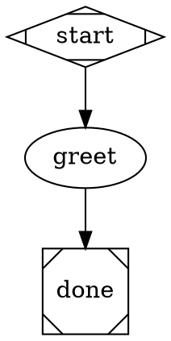
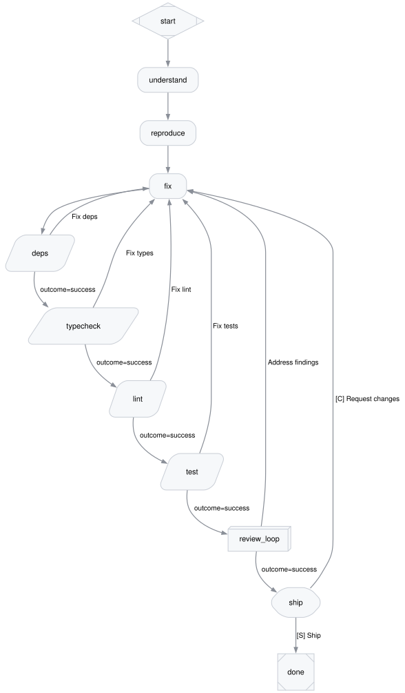

# attractor

A Go implementation of [Attractor](https://github.com/strongdm/attractor):
you describe a multi-stage AI workflow as a Graphviz DOT file — each node
is a stage (an LLM agent, a shell command, a human approval gate, a
parallel fan-out), each edge a route with an optional condition — and
attractor executes it, retries what's transient, records everything, and
shows you a live view of the run.



```bash
attractor run --backend simulation -var name=world hello.dot   # no LLM, wiring test
attractor run --ui -var name=world hello.dot                   # real agent + live waterfall UI
```

Pipelines are plain text: version them, diff them, render them. This is
what a real one looks like (`attractor render` output of the shipped
bug-fix pipeline — reproduce the bug, fix it, run the repo's checks, get
a five-lens adversarial review, pass a human ship gate):



## Relationship to the Attractor spec

The [upstream spec](./docs/spec/attractor.md) is kept pristine in this
repo and the implementation follows it closely — same node types, outcome
model, context, checkpointing, and status-file contract. Where we
deliberately differ, each deviation is written down in
[docs/spec/amendments/](./docs/spec/amendments/README.md). The three that
matter day-to-day:

- **`$context.<key>` interpolation happens at runtime** against the live
  context, not as a parse-time substitution (undefined keys fail the
  node — typos surface instead of passing through).
- **Every visit to a node keeps its own directory** (`<node>/v1/`,
  `v2/`, …) so a review/fix loop never overwrites the evidence of
  earlier rounds.
- **Sub-pipelines are inlined at load time** (`type="subgraph"`), not run
  by a supervisor node at runtime.

## How it works

**The unit of the system is a self-contained run.** `attractor run`
executes one pipeline and owns everything about it — no server or
central service is required to launch, watch, answer gates, or debug:

```
attractor run --ui            # engine + the run's own read-only API/UI
        │                     # runs anywhere: laptop, remote box, CI, a VM
        │ announce once ────▶ hub (optional): directory + archive of many runs
        │                     # hub PULLS state from live runs; nothing is pushed
        └ on complete: tar the run dir → ship to hub as the permanent record
```

**Everything a run is lives in one directory** (`~/.attractor/runs/<id>`):

```
run.json           identity: run id, graph name, resolved goal
events.jsonl       the source of truth: every engine event, one JSON per line
checkpoint.json    resume point, rewritten after each completed node
<node>/v1/         each visit's prompt.md, response.md, status.json, tool_calls/
<node>/…           the latest visit mirrored at the node root (stable paths)
```

To debug a run, read `events.jsonl` and the visit dirs — that is all
there is. Every view (the waterfall UI, the hub, the API documents) is
derived from that event log, never stored separately.

**The engine walks the graph one node at a time**: resolve the node's
handler (`codergen` agent, `tool` command, `wait.human` gate,
`parallel`), execute it with retries, apply its outcome to the shared
context, then follow the first edge whose condition matches
(`condition="outcome=fail"` routes failures to a fix stage). Agents
self-report through a status file; deterministic guards keep runs from
dying or spinning:

- Transient failures (rate limits, 5xx, stalls, network) retry with
  backoff; auth/config errors fail immediately.
- An agent that forgets its status file gets a corrective follow-up **in
  the same session** rather than a cold retry.
- A run that keeps failing the same way is aborted early ("stuck loop")
  instead of burning rounds; harness errors are never routed to a
  fix agent as if they were code findings.

**The hub is optional.** `attractor hub` aggregates many runs: they
register themselves once at start (`run --announce <hub-url>`), the hub
polls each run's own API for live state, proxies gate answers, and
stores each run's tar archive on completion as the permanent record —
served through the same API after the run process is gone. Because the
hub only pulls, a hub outage can never lose run data.

## Using it

### Install

```bash
nix build .#attractor     # → ./result/bin/attractor
```

Needs [nix](https://nixos.org) with flakes. The built binary bundles
everything agent runs need on its PATH: `graphviz`, `jj`, and the ACP
agent adapters (`claude-agent-acp`, `codex-acp`).

### Auth (one-time)

The default agent, `claude-agent-acp`, authenticates like Claude Code:

```bash
claude                # run Claude Code once and log in (credentials land in ~/.claude/)
# — or —
export ANTHROPIC_API_KEY=sk-ant-…
```

That's it — `attractor run --backend acp --acp-cmd claude-agent-acp …`
now runs real agents. To route different pipeline nodes to different
agents/models without flags, write `~/.attractor/config.json`
([full reference](./docs/provider-config.md)):

```json
{
  "default_provider": "anthropic",
  "providers": {
    "anthropic": {"backend": "acp", "command": "claude-agent-acp", "model_env": "ANTHROPIC_MODEL"},
    "codex":     {"backend": "acp", "command": "codex-acp",        "model_env": "CODEX_MODEL"}
  }
}
```

Nodes then pick providers/models with `llm_provider=` / `llm_model=`
attributes; a node with neither uses the default provider.

### Run a pipeline

```bash
# Validate first: transforms + lint, catches missing prompt files and
# $context typos before anything executes.
attractor validate my-pipeline/pipeline.dot

# Dry-run the wiring with no LLM:
attractor run --backend simulation -var name=world my-pipeline/pipeline.dot

# Real run with the live waterfall UI (URL printed at start):
attractor run --ui --cwd /path/to/target-repo \
  -var repo=owner/name -var identifier=BUG-1 -var title="…" -var url="…" \
  pipelines/bug-fix/pipeline.dot
```

- `-var name=value` seeds the run's context; a graph's `vars="…"` list
  declares which are required (missing ones fail before any node runs).
- `--cwd` is the working tree agents and tool commands operate in.
- `--human console|approve` controls approval gates in a terminal;
  under `--ui` gates render as buttons in the browser.
- Bare pipeline names resolve under `./pipelines/` then
  `~/.attractor/pipelines/`.

The `--ui` waterfall shows one lane per node with live spans, tool-call
tick marks, token counts, and click-through to every stage's actual
prompt, response, and status. The same data is served as JSON
(`/pipelines/{id}`, `/events?since=N`, `/artifacts/…`) for scripts and
agents.

### Shipped pipelines

Under `pipelines/`: `bug-fix` (pictured above), `implement` (plan →
human gate → implement → checks → review → draft PR), `review-pr`,
`revise-pr`, `build` (spec-milestone self-development), `checks`, and
`review-core` — the shared five-reviewer adversarial review that the
others embed via `subgraph`.

### Many runs: the hub

```bash
attractor hub --bind 127.0.0.1:7690 --dir ~/.attractor/hub

attractor run --announce http://127.0.0.1:7690 … pipeline.dot   # self-registers
curl -X POST 127.0.0.1:7690/pipelines \
  -d '{"path":"bug-fix","cwd":"/work/repo","vars":{"repo":"o/r","identifier":"X-1"}}'
```

`GET /runs` lists live + archived runs with reachability; everything
else is the same per-run API, proxied or served from the archive. For
runs on other machines, start them with `--ui-token <secret>` — the
token travels in the announce and the hub uses it on every poll.

## Making changes

Layout: `internal/engine` (graph traversal, retries, guards, event
log), `internal/handler` (node types), `internal/backend` (agent
transports), `internal/transform` (subgraph/prompt inlining),
`internal/lint` (validation), `internal/runserver` + `internal/runview`
(the per-run API/UI and the event-log folds), `internal/hub`. The e2e
suite in `tests/` drives real pipelines through the real engine; TDD is
the norm — bugs get a failing test first.

```bash
nix develop --command go test ./...    # full suite, offline, ~20s
```

**Use a different agent** — usually no Go needed. Any agent speaking the
[Agent Client Protocol](https://agentclientprotocol.com) works as-is:
point a node (`acp_command="my-agent"`), a graph, `--acp-cmd`, or a
provider-config entry at its command line.

**Write a new codergen backend** — for agents that don't speak ACP,
implement one interface in a subpackage of `internal/backend`:

```go
type CodergenBackend interface {
    Run(env engine.HandlerEnv, prompt string) (Result, error)
}
```

Return the agent's text (wrapped into a success outcome) or an explicit
`Outcome`; wrap transient errors with `backend.Transient(err)` so the
engine's retry machinery engages. Optionally implement
`Continue(env, prompt)` to support in-session corrections. Wire it into
`internal/backend/router` (provider-config routing) and/or the
`--backend` flag in `internal/cli`. `internal/backend/claudecode` is a
compact worked example (~250 lines); `internal/backend/fake` shows the
test harness pattern.

**Write a new pipeline** — a directory with a `pipeline.dot` (+
`prompts/*.md` referenced as `prompt="@prompts/x.md"`). Start from
`pipelines/bug-fix/`, and keep `attractor validate` green; the
`context_refs` lint cross-checks every `$context.*` reference against
declared vars and node outputs, so typos die before a run does.

**Agents working inside pipelines** must self-report via
`{stage_dir}/status.json` (the literal path is substituted into their
prompt): `{"outcome":"success"}` or
`{"outcome":"fail","failure_reason":"…"}`, plus optional
`"context_updates":{…}` to publish values downstream. When routed back
after a failure, `$context.failure_reason` carries what went wrong.

## Docs

| Doc | Covers |
|---|---|
| [attractor spec](./docs/spec/attractor.md) | the upstream pipeline/engine spec (pristine) |
| [amendments](./docs/spec/amendments/README.md) | every deliberate deviation from it |
| [local-first plan](./docs/local-first-plan.md) | why the architecture is self-contained runs + a pull-based hub |
| [loop-guards](./docs/loop-guards-spec.md) | the anti-futility guards' design |
| [provider-config](./docs/provider-config.md) | routing nodes to backends/models |
| [acp-backend](./docs/acp-backend.md) | the ACP transport in detail |

## License

[Apache License 2.0](./LICENSE) — matches upstream
[strongdm/attractor](https://github.com/strongdm/attractor).
